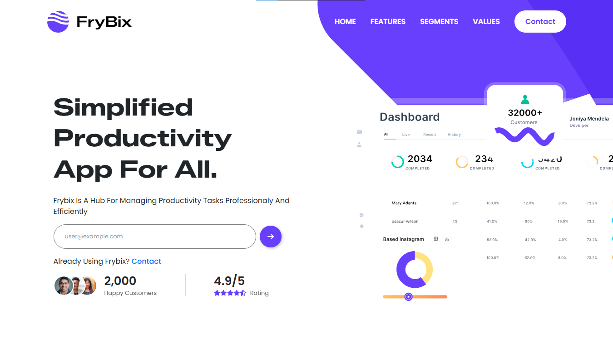

# 🚀 FryBix — React-Based SaaS Landing Page

**FryBix** is a modern SaaS landing page built for a mobile application, designed with a strong focus on **feature clarity, user engagement, and conversions**.  
The project emphasizes a clean UI, smooth responsiveness, and a realistic, business-oriented layout—ideal for SaaS products, startups, and business-focused applications.

---

## 🚀 Live Demo

🔗 **View Live Site:**  
https://frybix-web.netlify.app

---

## 📸 Preview

---

## 🧰 Tech Stack

- ⚛️ **React**
- 🎨 **Bootstrap 5**
- 🧭 **React Router DOM**
- ⚡ **Vite** (Build Tool)
- 🛠️ **Reusable Components & Hooks**

---

## ✨ Key Features

- 📱 **Fully responsive design** (mobile, tablet, desktop)
- 🧭 **Client-side routing** using React Router
- 🧩 **Reusable and modular components**
- 🚫 **Custom 404 page** for unmatched routes
- 📁 **Scalable and maintainable folder structure**
- 🎯 **Conversion-focused UI design**

---

## 📁 Project Setup

Follow these steps to run the project locally:

# Clone the repo
git clone https://github.com/askdanish144/frybix-react-saas.git

# Navigate into the directory
cd frybix-react-saas

# Install dependencies
npm install

# Run the development server
npm run dev

---

## ✨ Author

Crafted with attention to detail by **Danish Ali**  
Full Stack Developer | Graphic Designer

🌐 Portfolio: https://www.danishali.site  
📧 Email: askdanish144@gmail.com

---

## 📬 Interested in a website like this?

I’m available to build clean, responsive, and business-focused websites tailored to your needs — whether you’re a startup, local business, or growing brand.

Feel free to reach out to discuss your project.
